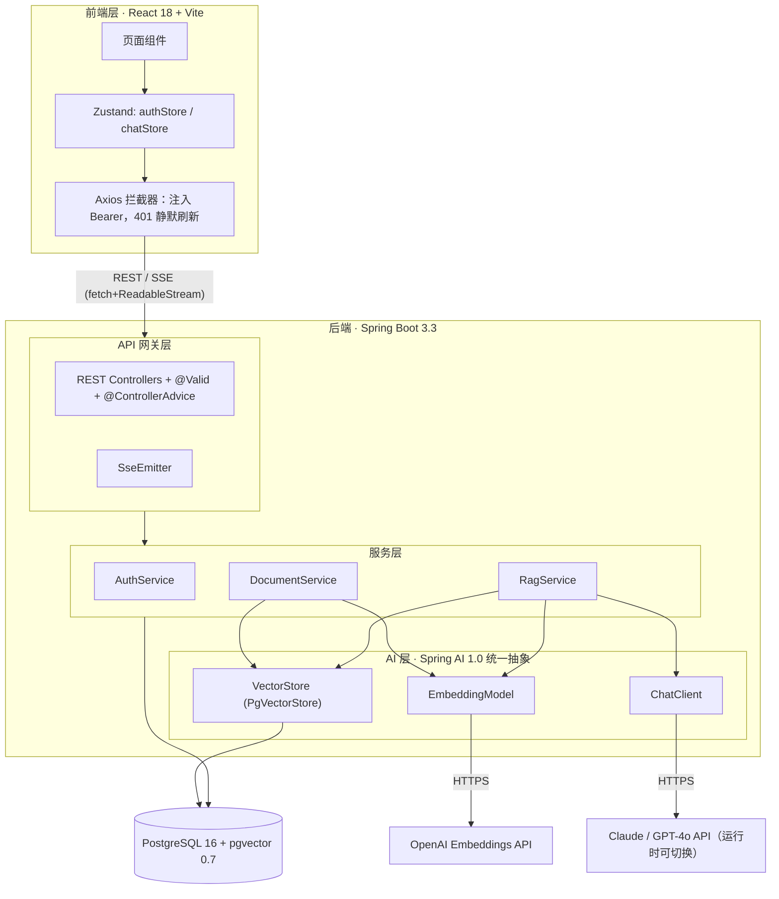
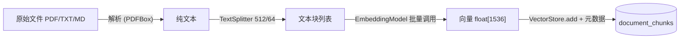
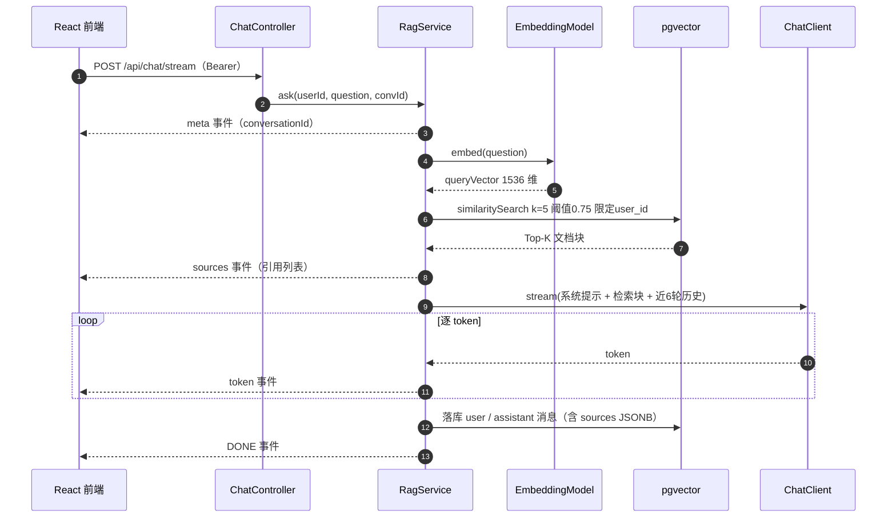

# System Architecture（系统架构）

> **项目**：Portfolio RAG 智能文档问答系统 · Wiki 页面 05
> **版本**：v0.1（草案，待评审） · **日期**：2026-06-13 · **来源**：报告 4.2 / 4.3 / 4.6 / 4.7 / 4.8
> 图采用 Mermaid，GitHub Wiki / README 原生渲染。

| 变更记录 | 日期 | 改动 | 原因 |
|---|---|---|---|
| v0.1 | 2026-06-13 | 初稿 | — |

---

## 1. 总览（五层 + 两个外部依赖）

## 2. 分层职责（浓缩自表 4.2）

| 层 | 组件 | 一句话职责 |
|---|---|---|
| 前端层 | React SPA | 交互、表单校验、SSE 接收与打字机渲染、路由守卫 |
| API 网关层 | Controllers / SseEmitter | 路由、参数校验、JWT 过滤、统一异常处理、SSE 长连接 |
| 服务层 | AuthService | JWT 签发验签、注册登录、Refresh Token 吊销 |
| 服务层 | DocumentService | 文件存储、解析（PDFBox）、分块调度、documents 状态机 |
| 服务层 | RagService | 问题向量化、pgvector 检索、Prompt 构造、ChatClient 流式调用 |
| AI 层 | EmbeddingModel / VectorStore / ChatClient | Spring AI 标准接口，提供商可配置切换 |
| 数据层 | PostgreSQL + pgvector | 六表持久化（见 4.4），关系 + 向量同库同事务 |

四条架构原则：关注点分离（禁止跨层调用）、依赖倒转（依赖 Spring AI 抽象而非具体厂商）、最小权限（Security 默认拒绝、白名单放行）、数据隔离（Service 层强制注入 userId 过滤）。

## 3. 两条核心管线

### 3.1 文档入库流（异步）

状态机：`pending → processing → done | error`，每次转移落库，失败写 `error_msg` 并支持手动重试（《07》F-01/F-07/F-09）。

### 3.2 问答检索流（SSE）

两条管线的外呼（Embedding / LLM）均为异步或响应式处理，主线程吞吐不受外部延迟拖累（NFR 并发 ≥20）。

## 4. 技术栈（浓缩自表 4.1）

| 维度 | 选型 | 版本 |
|---|---|---|
| 前端 | React + Vite + Zustand + TailwindCSS | 18 / 5 / 4 / 3 |
| 后端 | Spring Boot + Security + Spring AI + Data JPA | 3.3 / 6 / 1.0 GA / 3 |
| AI | text-embedding-3-small；Claude 3.5 Sonnet 或 GPT-4o | 提供商可切换 |
| 数据库 | PostgreSQL + pgvector（IVFFlat / HNSW） | 16 + 0.7 |
| 基础设施 | Docker Compose + Spring Actuator | 24.x |

## 5. 安全纵深（4.7 摘要）

传输层 HTTPS → 认证层 JWT（HS256 密钥 ≥256 bit 或 RS256；Refresh 为随机 UUID，登出置 `revoked=true`）→ 授权层 FilterChain 验签 + **Service 层二次校验 userId 归属**（防水平越权的真正闸门）→ 数据层 JPA 参数绑定 + 检索 SQL 强制带 user_id → 输入层 MIME 校验（不信扩展名）+ Bean Validation。前端折中：accessToken 仅存内存、refreshToken 存 localStorage（报告已注明 HttpOnly Cookie 为理想方案，上生产前复审）。

## 6. 部署拓扑（docker-compose 三容器）

| 服务 | 镜像 / 基底 | 关键配置 |
|---|---|---|
| postgres | postgres:16 + pgvector | 数据卷持久化；healthcheck = `pg_isready`；启动执行 `init.sql` |
| backend | eclipse-temurin:21-jre | `depends_on: postgres(healthy)`；环境变量注入连接串与 API Key；暴露 `/actuator/health` |
| frontend | nginx | 静态托管 React 产物；反代 `/api/**` → backend；history 模式 fallback |

`.env`（git ignored）：`POSTGRES_PASSWORD`、`JWT_SECRET`、`OPENAI_API_KEY`、`ANTHROPIC_API_KEY`。生产以 Docker Secrets / 云密钥服务替代。

## 7. 关键设计决策（ADR-lite）

| 决策 | 选择 | 理由 | 重新评估触发条件 |
|---|---|---|---|
| 向量存储 | pgvector 而非独立向量库 | 零额外基础设施；关系 + 向量同库同事务（第二章论证） | 向量 >100 万 → HNSW 或专用库 |
| 分块策略 | 固定 512 / 重叠 64 | 经验最优区间的保守基准（2.2.3） | 评测 hit@5 <80% 时第一调参对象；语义分块 = v2 |
| LLM 接入 | Spring AI 三抽象 | 提供商运行时可换，防锁定；项目差异化卖点 | — |
| 认证 | JWT 双 Token；Refresh = 不透明 UUID | 无状态访问 + 服务端可吊销 | 多设备会话管理需求 |
| SSE 传输 | fetch + ReadableStream，POST + JSON body | D-01 / D-02，见《06》决策记录 | — |
| 检索参数 | k=5，阈值 0.75 | FR-04 既定值 | 由评测数据驱动调整，不拍脑袋 |
