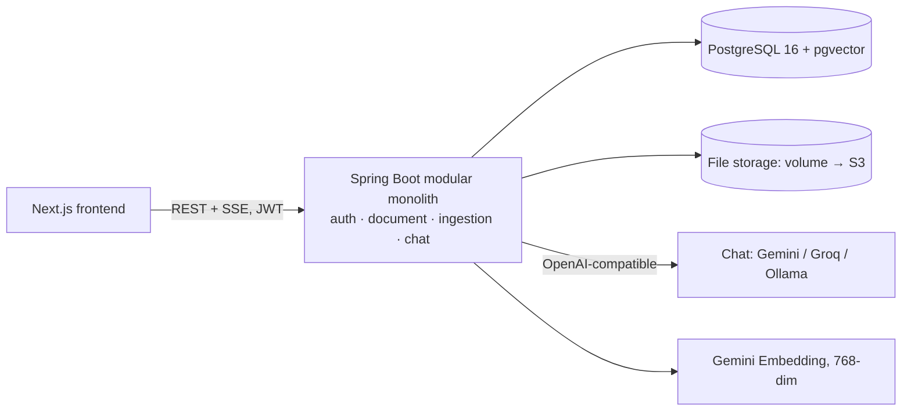

# Portfolio RAG

> Private knowledge-base Q&A for individuals and small teams — upload PDF / TXT / Markdown, ask in natural language, get **streamed answers with source citations**. Demo corpus: public financial documents (annual reports, prospectuses, compliance handbooks).

**Status: in active development.** This repo currently ships the full engineering charter — scope, requirements with acceptance criteria, architecture, ADRs, and a task plan. Implementation follows `docs/04-TASKPLAN.md` card by card.

## Why this project

Built as a portfolio flagship to demonstrate production-minded engineering rather than a weekend RAG demo:

- Multi-user JWT auth with **data isolation tested down to the vector-retrieval layer**
- RAG pipeline on PostgreSQL + pgvector (relational data and vectors in one transactional store)
- SSE streaming with a typed event protocol (`token / sources / done / error`)
- Rate-limit resilience (batching + exponential backoff) against free-tier LLM APIs
- Every non-obvious choice documented as an ADR, including *when it should be revisited*

## Planned architecture

## Tech stack

Java 21 · Spring Boot 3 · Spring AI · Maven · PostgreSQL 16 + pgvector · Flyway · Next.js (App Router) · Tailwind · Docker Compose · GitHub Actions · AWS (single node).
LLM providers are switchable by Spring profile via OpenAI-compatible endpoints; embeddings are pinned (see ADR-008 on embedding lock-in).

## Roadmap

- [ ] **Gate 1 — Technical MVP**: full loop via API (register → upload → streamed, cited answers), isolation tests green
- [ ] **Gate 2 — Portfolio MVP**: minimal web UI, one-command `docker compose up`, demo GIF in this README
- [ ] **Gate 3 — Full version**: cloud deployment, retrieval evaluation suite, hybrid search

## Docs

| Doc | Purpose |
|---|---|
| `docs/00-BRIEF.md` | Project charter: goals, constraints, milestones |
| `docs/01-SCOPE.md` | In/out of scope, change-control rules |
| `docs/02-REQUIREMENTS.md` | FRs with executable acceptance criteria, NFRs |
| `docs/03-ARCHITECTURE.md` | C4 diagrams, ERD, API table, SSE protocol |
| `docs/adr/` | Architecture Decision Records (001–008) |
| `CLAUDE.md` | Working charter for AI-assisted development |

Internal docs are written in Chinese for authoring velocity; ADR summaries and user-facing docs will be fully English by Gate 2.

## Quickstart

Arrives with Gate 1. Target experience: `docker compose up --build`, then open `http://localhost:3000`.

## Demo simplifications

No email verification, password reset, or OAuth login — deliberate portfolio-scope decisions (the point is the hand-built JWT flow), documented with reasons in `docs/01-SCOPE.md`.
