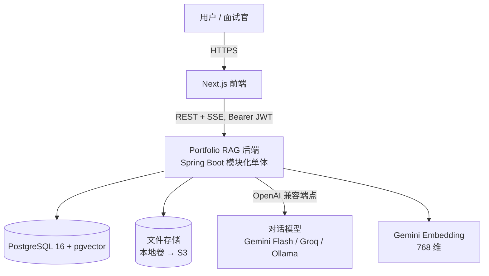
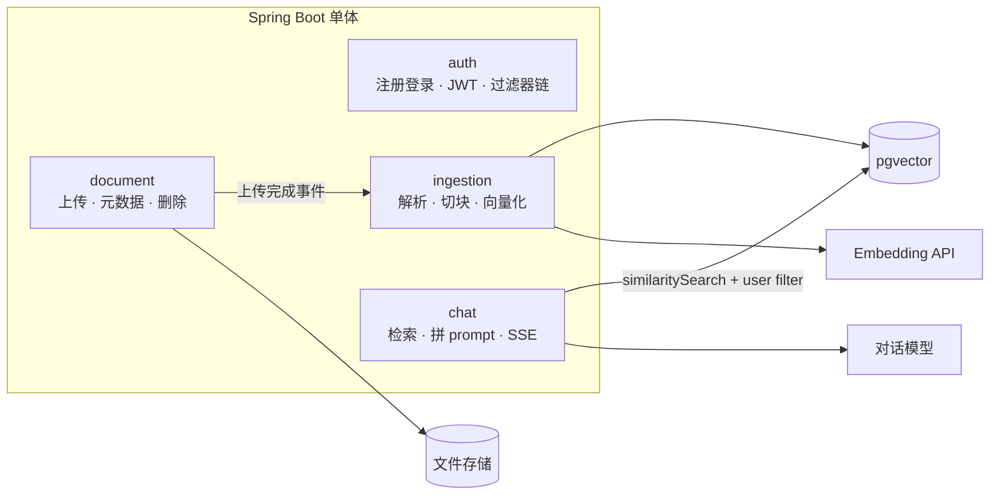
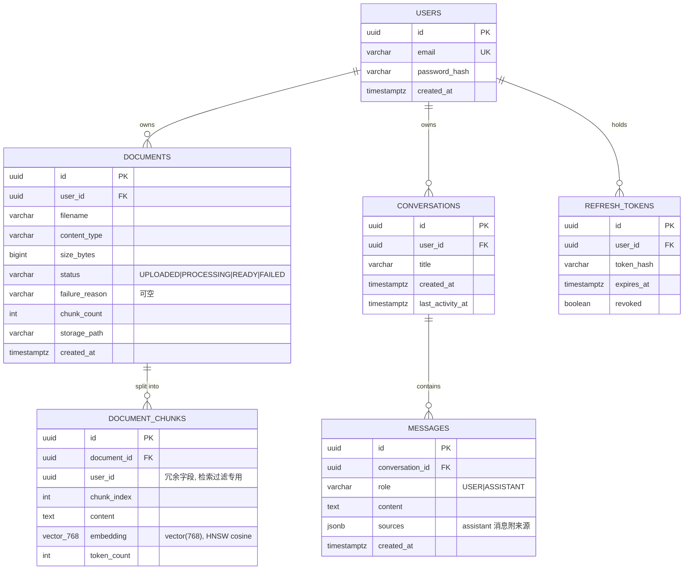

# 03 · 系统架构（Architecture）

> **用途**：实现期的地图。任务卡里"涉及文件 / 约束"一栏引用本文的模块、表、端点与协议编号。
> **状态**：v1.0 定稿（2026-07-10）

## 1. C4 · Context（系统在世界中的位置）



## 2. C4 · Container（单体内部四模块）



### 模块职责与依赖规则（ADR-002）

| 模块 | 职责 | 允许依赖 |
|---|---|---|
| auth | 注册 / 登录 / 刷新 / 登出；SecurityFilterChain；JWT 签发校验 | common |
| document | 上传校验、配额、元数据 CRUD、删除级联入口 | common、ingestion（触发） |
| ingestion | Tika 抽取 → 切块 → 分批 embedding → 写 chunks；状态机推进 | common |
| chat | 会话与消息；检索、阈值拒答、prompt 组装、SSE 下发 | common |
| common | 全局配置、Problem Details 异常处理、共享 DTO 约定 | 无 |

横向 import 违例由 ArchUnit 测试拦截（P1 起，NFR-4）。

## 3. 数据模型（ERD）



Flyway 管全部迁移，版本规划：V1 基线（init）→ V2 users/documents → V3 refresh_tokens → V4 chunks + HNSW cosine 索引 → V5 conversations/messages（ADR-003 / 008）。

## 4. API 端点表

| 方法 | 路径 | 鉴权 | FR |
|---|---|---|---|
| POST | /api/auth/register | 否 | A1 |
| POST | /api/auth/login | 否 | A2 |
| POST | /api/auth/refresh | 否（凭 refresh token） | A3 |
| POST | /api/auth/logout | 是 | A3 |
| POST | /api/documents | 是 | D1 / D2 |
| GET | /api/documents?page=&size= | 是 | D4 |
| GET | /api/documents/{id} | 是 | D4 |
| DELETE | /api/documents/{id} | 是 | D5 |
| POST | /api/conversations | 是 | Q6 |
| GET | /api/conversations | 是 | Q6 |
| DELETE | /api/conversations/{id} | 是 | Q6 |
| GET | /api/conversations/{id}/messages | 是 | Q6 |
| POST | /api/conversations/{id}/messages | 是，SSE 响应 | Q1–Q5 |
| GET | /actuator/health | 否（P1） | NFR-5 |

错误一律 Problem Details（FR-E4）。跨用户资源一律 404（ADR-004）。

## 5. SSE 事件协议（FR-Q3 的规格）

请求：`POST /api/conversations/{id}/messages`，`Accept: text/event-stream`，body `{"content": "..."}`。

| 事件 | data 结构 | 次数与顺序 |
|---|---|---|
| token | `{"delta": "文本增量"}` | 0..n 次，最先 |
| sources | `{"sources": [{documentId, filename, chunkId, snippet, score}]}` | 恰 1 次，token 流结束后；**拒答时为空数组但仍发送** |
| done | `{"messageId": "..."}` | 恰 1 次，正常终止 |
| error | `{"code": "...", "message": "..."}` | 出错时替代 done，随后关闭连接 |

另：每 15 秒发注释行 `: ping` 防代理断连。客户端以 fetch + ReadableStream 消费（ADR-005）。

## 6. 两条流水线

**Ingestion（写路径）**：上传落盘（storage_path）→ 状态置 PROCESSING（独立线程池 `ingestionExecutor`，有界队列）→ Tika 抽文本 → TokenTextSplitter 切块（500–800 token，overlap ≈ 80）→ 分批调 Gemini Embedding（429 指数退避，FR-E3）→ 批量写 document_chunks（携带 user_id 冗余）→ 状态 READY + chunk_count。任一步失败 → FAILED + 用户可读原因，绝不抛向全局。

**Query（读路径）**：校验会话属主（404 策略）→ 取近 N=6 条消息 → 问题向量化 → pgvector top-k（k=4）+ user_id filter → 最高分低于阈值（初值 0.50，配置化，Phase 3 用真实语料校准）→ 走拒答路径；否则组装 prompt（系统约束 + 检索片段 + 历史 + 问题）→ 流式调对话模型 → SSE 逐 token → 发 sources → 落库 assistant 消息（sources 存 jsonb）→ done。

## 7. Profile 矩阵

| profile | 对话模型 | embedding | 数据库 | 文件 | 说明 |
|---|---|---|---|---|---|
| dev | Gemini Flash（或切 Groq） | Gemini Embedding 768 | 本地 compose PG | 本地卷 | 日常开发 |
| demo-offline | Ollama 本地 | 仍为 Gemini Embedding | 本地 compose PG | 本地卷 | **诚实局限**：只兜"生成端挂了"这种最常见事故；真断网时 embedding 也不可用，此场景演示 = 播放 README GIF（BRIEF 已备双保险） |
| prod | Gemini Flash + Groq 互备 | Gemini Embedding 768 | EC2 上 compose PG（卷持久化） | S3（P1） | Gate 3 |

## 8. 目录结构草案

```
src/main/java/dev/<you>/portfoliorag/
  auth/        controller · service · jwt · SecurityConfig
  document/    controller · service · repository · model
  ingestion/   pipeline · splitter 配置 · executor 配置
  chat/        controller(SSE) · retrieval · prompt · service
  common/      GlobalExceptionHandler(ProblemDetails) · 全局配置
src/main/resources/
  application.yml + application-{dev,demo-offline,prod}.yml
  db/migration/   Flyway V1__init.sql ...
src/test/java/...  含 DocumentIsolationTest 等
```

## 9. 关键设计说明（面试高频三处）

1. **user_id 冗余进 chunks**：检索时无需 join documents 即可按属主过滤，向量查询保持单表。代价：文档不可转移属主——本就在 out-of-scope，代价为零。
2. **删除的事务边界**：documents 行与 chunks 在同一数据库事务内删除；**文件删除放事务提交之后**——数据库事务管不到文件系统，盘上删除失败只记日志、靠定期清理兜底，绝不为此回滚已成功的库删除。
3. **线程池隔离**：ingestion 用独立有界线程池，队列满时拒绝并转 FAILED，长任务永不挤占 Web 与问答线程——这正是 ADR-002"重审触发"所监控的那条边界。
